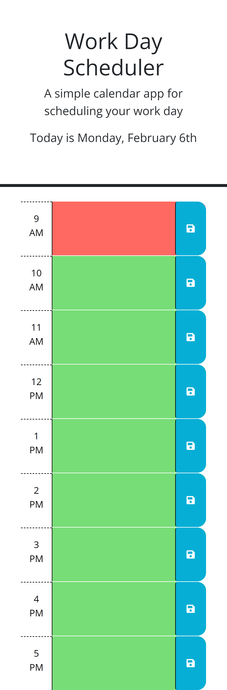

# Daily-Planner

## Description

As someone with a busy schedule, it's only proper to have a time organization method. That's why I've created a daily planner application.
This daily planner application makes the process of writing and storing a note at a certain hour in the work day easy! It allows the user to type in a note in the text box and save what they wrote for the next time they enter the application.

## Usage

To store a note, simply write the desired content in one of the 9 text boxes. After, click on the save button directly to the right of it. The next time (and all future times) the user reloads the page, the text that was entered will remain.

### Link to Application

https://cmeesh11.github.io/Daily-Planner/

### Screenshot of application

